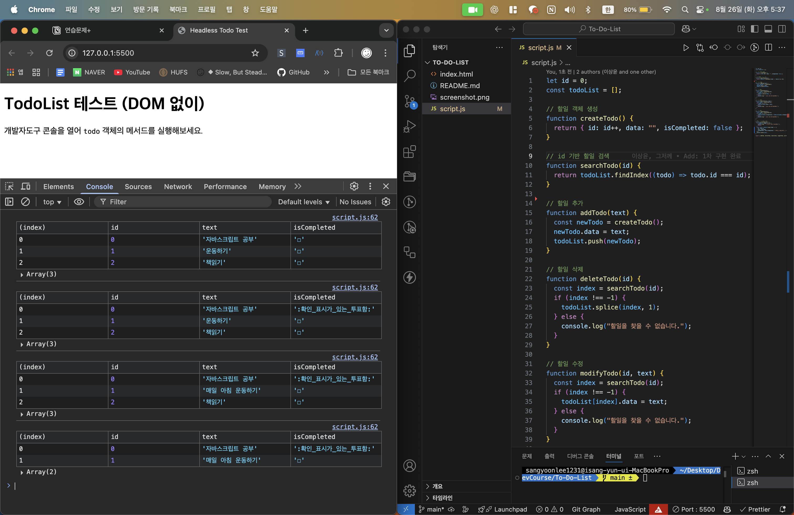

## To Do List DOM 없이 구현하기

- 1차 팀 - 3번째 팀 활동

<br/>

### 전체 기능

| 기능                | 함수명               | 설명                                 |
| ------------------- | -------------------- | ------------------------------------ |
| 할일 추가           | addTodo(text)        | 할일을 입력 받아서 todos 배열에 추가 |
| 할일 삭제           | deleteTodo(id)       | 등록된 할일을 삭제                   |
| 할일 수정           | modifyTodo(id, text) | 등록된 할일을 수정                   |
| 할일 완료           | toggleTodo(id)       | 등록된 할일의 완료 여부 토글         |
| 현재 할일 목록 출력 | printTodoList()      | 현재 할일 목록을 반복 콘솔 출력      |

<br/>

### 폴더 구성 예시

```bash
/todolist-headless/
│
├─ index.html          # (선택) 브라우저에서 콘솔 테스트용
├─ script.js           # Todo 모듈 (비DOM)
```

<br/>

### 모의 호출 예시

```js
todo.addTodo("자바스크립트 공부");
todo.addTodo("운동하기");
todo.addTodo("책읽기");
todo.printTodoList();

todo.toggleTodo(0);
todo.printTodoList();

todo.modifyTodo(1, "매일 아침 운동하기");
todo.printTodoList();

todo.deleteTodo(2);
todo.printTodoList();
```

<br/>

---

## 설계

### 데이터 설계

- 할 일이 객체 형태로 관리된다.

```js
const toDo = {
  id: 1, // 할 일 데이터를 서로 구분하는 고유한 속성 (Number)
  data: "JS 마스터하기" // 실제 할 일 내용을 담는 속성 (String)
  isCompleted: true // 할 일을 완료했는지를 나타내는 속성 (Boolean)
};
```

- `createTodo()` 함수를 통해 객체를 생성한다.

```js
let id = 0;

function createTodo() {
  return { id: id++, data: "", isCompleted: false }; // 기본값
}
```

- 할 일 객체들은 객체 배열을 통해 관리된다.

```js
const todoList = [
  { id: 0, data: "공부하기", isCompleted: true },
  { id: 1, data: "책읽기", isCompleted: false },
  { id: 2, data: "JS 마스터하기", isCompleted: false },
];
```

<br/>

### 각 함수 동작 설계

| 기능               | 함수명        | 설명                                 |
| ------------------ | ------------- | ------------------------------------ |
| 할일 추가 (Create) | addTodo(text) | 할일을 입력 받아서 todos 배열에 추가 |

- 할 일 내용을 매개변수로 받음
- `createTodo()` 함수를 통해 toDo 객체를 새로 생성
- 매개변수로 받은 text를 새로 생성된 todo 객체의 data 속성에 할당
- 이 todo 객체를 todoList 객체 배열의 끝에 추가 (push)

<br/>

| 기능               | 함수명         | 설명               |
| ------------------ | -------------- | ------------------ |
| 할일 삭제 (Delete) | deleteTodo(id) | 등록된 할일을 삭제 |

- id값을 매개변수로 받음
- id값을 기준으로 todoList 객체 배열을 탐색
- id값에 해당하는 객체를 찾으면, splice 메서드를 통해 해당 객체를 배열에서 제거

<br/>

| 기능               | 함수명               | 설명               |
| ------------------ | -------------------- | ------------------ |
| 할일 수정 (Update) | modifyTodo(id, text) | 등록된 할일을 수정 |

- id값을 매개변수로 받음
- id값을 기준으로 todoList 객체 배열을 탐색
- id값에 해당하는 객체를 찾으면, 해당 객체의 data 속성을 text로 변경

<br/>

| 기능      | 함수명         | 설명                         |
| --------- | -------------- | ---------------------------- |
| 할일 완료 | toggleTodo(id) | 등록된 할일의 완료 여부 토글 |

- id값을 매개변수로 받음
- id값을 기준으로 todoList 객체 배열을 탐색
- id값에 해당하는 객체를 찾으면, 해당 객체의 isCompleted 속성을 반전 (true->false 혹은 false->true)

<br/>

| 기능                       | 함수명          | 설명                            |
| -------------------------- | --------------- | ------------------------------- |
| 현재 할일 목록 출력 (Read) | printTodoList() | 현재 할일 목록을 반복 콘솔 출력 |

- todoList 객체 배열을 처음부터 끝까지 탐색하며 각 객체를 출력

<br/>

#### 추가로 필요한 함수

| 기능           | 함수명       | 설명                                                |
| -------------- | ------------ | --------------------------------------------------- |
| todo 생성 함수 | createTodo() | todo 데이터의 속성을 정의하고 새 객체를 생성해 반환 |

<br/>

| 기능               | 함수명         | 설명                                     |
| ------------------ | -------------- | ---------------------------------------- |
| todoList 탐색 함수 | searchTodo(id) | id값에 해당하는 객체 찾아 index값을 반환 |

<br/>

---

## 실행 결과



<br/>
